  

<code>imandro@github ~ $ cat about.md</code>

  

<code>imandro@github ~ $ ./contributions.sh</code>

  

<code>imandro@github ~ $ whoami</code>

<table>
<tr>
<td valign="top"></td>
<td valign="top"></td>
</tr>
</table>

  

<code>imandro@github ~ $ ./trofeos --contar</code>

  

<code>imandro@github ~ $ cat stack.yml</code>

  

<code>imandro@github ~ $ ls projects/</code>

 

<a href="https://github.com/Imandro/AliviaApp"><b>AliviaApp</b></a> ·
<a href="https://github.com/Imandro/duAI"><b>duAI</b></a> ·
<a href="https://github.com/Imandro/ConectaMas"><b>ConectaMas</b></a> ·
<a href="https://alivia-tu-salud.vercel.app"><b>Alivia (web)</b></a>

